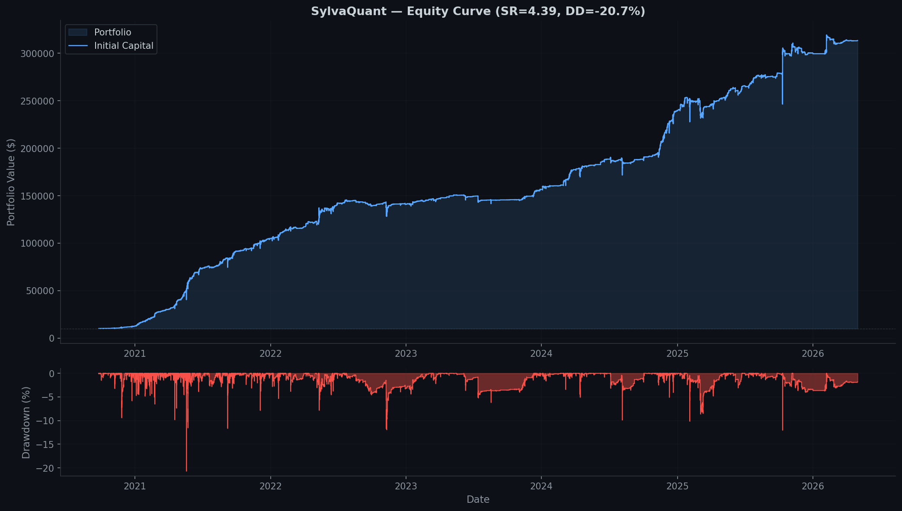

# Crypto Research — Random Forest 15m Trading Strategy

Multi-coin portfolio strategy using Random Forest + Triple Barrier labels on 15m Binance data. Features 62 engineered predictors across price, volume, volatility, and micro-structure dimensions, with Combinatorial Purged Cross-Validation (CPCV) for robust evaluation.

**⚠️ Disclaimer:** This is research code for educational purposes. Cryptocurrency trading carries significant risk. Not financial advice.

## Results (CPCV OOS, 4.49 years)

| Metric | Value |
|--------|:-----:|
| Final equity ($10K →) | **$313K** (+3,034%) |
| Sharpe ratio (daily) | **4.39** |
| Max drawdown | -20.7% |
| Period | 6.3 years (2020–2026) |
| Annual return | +553% |


## How it works

### Pipeline
```
Binance 15m data
    ↓ load_binance()
62 features (returns, volatility, volume, candle structure, wick patterns...)
    ↓ compute_features()
Triple Barrier labels (3-class: long/flat/short) on VWAP
    ↓ tb_labels()
CPCV (6 blocks, 15 paths) with embargo + purging
    ↓ cpcv_eval()
Per-coin signal → EMA smooth → threshold → portfolio PnL
    ↓ backtest_pnl()
```

### Key design decisions

| Choice | Rationale |
|--------|-----------|
| **VWAP pricing** | Taker execution fills at VWAP, not close. Offsets: entry+1, return+2 |
| **3-class labels** | Train RF on all bars (no tr_mask filter) → meaningful p_flat≈36% |
| **CPCV** | Lopez de Prado's combinatorial CV with embargo + purging |
| **EMA on signal** | `α=0.50` smooths prediction noise before threshold → fewer but better trades |
| **Per-coin TH** | SR-optimized threshold per symbol (0.10–0.19) adapts to coin-specific volatility |
| **RF 40/8/50** | More trees overfits. Depth 8 + leaf 50 prevents memorization |
| **Equal weight** | Dynamic weights (inv-vol, min-var) tested — equal weight wins |

## Setup

```bash
git clone <repo-url>
cd crypto-research

# Python 3.10+ with:
pip install numpy pandas scikit-learn matplotlib

# Data: download Binance 15m monthly ZIPs to data/
# Format: {SYMBOL}-15m-{YYYY}-{MM}.zip
# e.g., data/BTCUSDT-15m-2024-01.zip
```

### Quick start

```bash
# 1. Run CPCV for all 9 coins
python src/run_cpcv_oos.py

# 2. Portfolio backtest (uniform TH=0.10)
python src/backtest_oos.py

# 3. Portfolio backtest (per-coin SR-optimized TH)
TH_PER_COIN=1 python src/backtest_oos.py

# 4. Online simulation
python src/online.py
```

### Environment variables

| Var | Default | Description |
|-----|---------|-------------|
| `TH` | 0.10 | Signal threshold |
| `FEE` | 0.0004 | Taker fee (0.04%) |
| `EMA_ALPHA` | 0.50 | EMA smoothing factor |
| `TH_PER_COIN` | 0 | Use per-coin TH_MAP |
| `WEIGHT_SCHEME` | equal | Portfolio weighting |

## Portfolio

| Symbol | Weight | Description |
|--------|:------:|-------------|
| BTCUSDT | 1/9 | Bitcoin |
| ETHUSDT | 1/9 | Ethereum |
| SOLUSDT | 1/9 | Solana |
| BNBUSDT | 1/9 | Binance Coin |
| ADAUSDT | 1/9 | Cardano |
| XRPUSDT | 1/9 | Ripple |
| DOGEUSDT | 1/9 | Dogecoin |
| DOTUSDT | 1/9 | Polkadot |
| AVAXUSDT | 1/9 | Avalanche |

## Feature catalog (62 total)

### Price returns (11)
`ret_1`, `ret_2`, `ret_4`, `ret_8`, `ret_16`, `ret_24`, `ret_32`, `ret_48`, `ret_64`, `ret_96`, `ret_128`

### Absolute returns / volatility (11)
`abs_ret_1` through `abs_ret_128` — rolling return magnitude

### Return-volume correlation (4)
`ret_vol_corr_16/32/64/96` — correlation of returns with log volume

### Candle structure (6)
`hl_range_16/48/96` — normalized high-low range
`close_pos_16/48/96` — close position within candle

### Buying pressure (3)
`buy_frac_16/48/96` — taker buy volume / total volume ratio

### Volatility dynamics (6)
`vol_skew_48/96` — rolling return skewness
`vol_delta_16/48` — volatility acceleration
`vol_max_16/48` — extreme volatility gauge

### Volume dynamics (5)
`vol_ratio_16_96` — volatility term structure
`vol_surge_16/48` — volume / SMA(volume)
`qv_surge_16/48` — quote volume surge

### Trend quality (4)
`consec_up_8/24` — streak of positive returns
`consec_vol_16/48` — fraction of low-volatility bars

### Price structure (4)
`ret_ma_dist_48/96` — distance from moving average
`ret_range_pos_48/96` — position in min-max range

### Wick structure (4)
`up_wick_16/48` — upper wick / total range
`dn_wick_16/48` — lower wick / total range

### Risk-adjusted momentum (4)
`ret_sharpe_48/96` — rolling Sharpe of returns
`ret_acf_16/48` — return autocorrelation

## Files

| File | Purpose |
|------|---------|
| `src/pipeline_cpcv.py` | Core: data loading, 62 features, TB labels, CPCV, PnL |
| `src/run_cpcv_oos.py` | CPCV → save OOS predictions for all coins |
| `src/backtest_oos.py` | Portfolio backtest from saved OOS predictions |
| `src/batch_train.py` | Retrain final models (all coins) |
| `src/online.py` | Online simulation (daily incremental) |
| `src/feature_select_cpcv.py` | Feature selection via CPCV ablation |
| `src/validate_feature_select.py` | Multi-coin validation |

## References

- López de Prado, M. "Advances in Financial Machine Learning" (2018)
- Dixon, M. et al. "Machine Learning in Finance" (2020)
- [CPCV combinatorial cross-validation](https://papers.ssrn.com/sol3/papers.cfm?abstract_id=3305082)
- [Triple Barrier labeling](https://papers.ssrn.com/sol3/papers.cfm?abstract_id=3423965)
